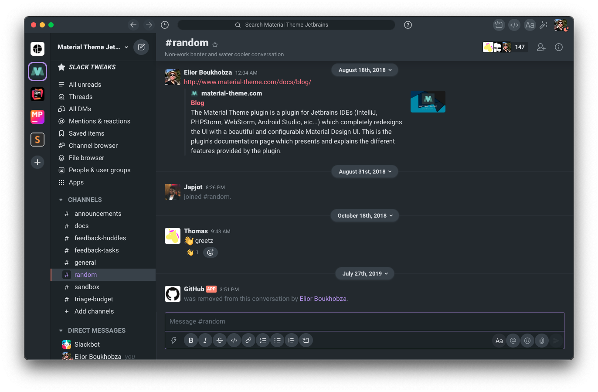
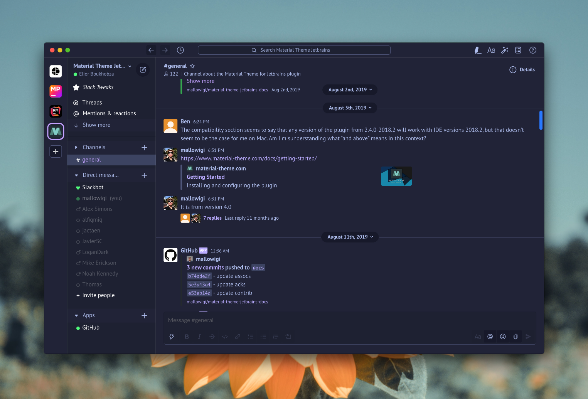

# mtslack (Material Themed Slack)

<!-- ALL-CONTRIBUTORS-BADGE:START - Do not remove or modify this section -->
[](#contributors-)
<!-- ALL-CONTRIBUTORS-BADGE:END -->

Beautify your Slack application from a list of popular themes!!!

# IMPORTANT NOTICE

Since version 4.22.0, there is no longer a way to patch the Slack application as Slack has patched the option to add
custom code.

This makes sense, as doing so would potentially allow people to inject malicious code into the application (this plugin
isn't, of course).

Therefore, this great plugin will no longer patch the Slack application; instead, it will generate a code snippet that
can be pasted into the Slack application to inject the themes manually.

Currently works only for Mac OS and Linux, as it uses `pbcopy` to handle the copy to clipboard. Contributions for
Windows are welcome.

**Theme List**:

- Material Oceanic 
- Material Darker 
- Material Palenight 
- Material Lighter 
- Material DeepOcean 
- Monokai Pro 
- Arc Dark 
- Dracula 
- GitHub 
- GitHub Dark 
- Atom One Dark 
- Atom One Light 
- Solarized Dark 
- Solarized Light 
- Night Owl 
- Light Owl 
- Moonlight 

----------------------------

# Pledge

If you like this plugin, you can buy me a beer (or a coffee, or something else)
using [PayPal](https://paypal.me/mallowigi?locale.x=en_US)

You can also support this theme by subscribing to the
OpenCollective. [[Become a sponsor](https://opencollective.com/atom-material-themes-and-plugins#sponsor)]

## Backers

Thank you to all our backers! 🙏 [[Become a backer](https://opencollective.com/atom-material-themes-and-plugins#backer)]

<a href="https://opencollective.com/atom-material-themes-and-plugins#backers" target="_blank"></a>

Check also : <https://www.material-theme.com/docs/support-us/>

## Sponsors

Support this project by becoming a sponsor. Your logo will show up here with a link to your
website. [[Become a sponsor](https://opencollective.com/atom-material-themes-and-plugins#sponsor)]

<a href="https://opencollective.com/atom-material-themes-and-plugins/sponsor/0/website" target="_blank"></a>
<a href="https://opencollective.com/atom-material-themes-and-plugins/sponsor/1/website" target="_blank"></a>
<a href="https://opencollective.com/atom-material-themes-and-plugins/sponsor/2/website" target="_blank"></a>
<a href="https://opencollective.com/atom-material-themes-and-plugins/sponsor/3/website" target="_blank"></a>
<a href="https://opencollective.com/atom-material-themes-and-plugins/sponsor/4/website" target="_blank"></a>
<a href="https://opencollective.com/atom-material-themes-and-plugins/sponsor/5/website" target="_blank"></a>
<a href="https://opencollective.com/atom-material-themes-and-plugins/sponsor/6/website" target="_blank"></a>
<a href="https://opencollective.com/atom-material-themes-and-plugins/sponsor/7/website" target="_blank"></a>
<a href="https://opencollective.com/atom-material-themes-and-plugins/sponsor/8/website" target="_blank"></a>
<a href="https://opencollective.com/atom-material-themes-and-plugins/sponsor/9/website" target="_blank"></a>

# Installation

### Global installation (only for Unix based systems)

1. Run `npm install -g mtslack` in a terminal (or run `sudo npx mtslack` if you don't want to install it globally)
2. Run the command `sudo mtslack` (in Windows, you need to open the Terminal in Administrator Mode)
3. You will be prompted with a menu the following options:
    - Copy code to clipboard
    - Show plugin version

4. Select *Copy to clipboard* to copy the code snippet to your clipboard.
5. Open Slack in dev mode: `export SLACK_DEVELOPER_MENU=true; open -a /Applications/Slack.app`
6. Open the Dev Tools and paste the code snippet in the console.
7. ?????
8. PROFIT!!!!!!!

----

### Slack Tweaks

Since version 2.0 you can also profit from a bunch of **Slack Tweaks** to make the application more enjoyable. You can
find a button to open the Slack Tweaks on the channels sidebar.

#### Slack Tweak Control Panel


This panel controls which tweak toggles are available. **This doesn't actually toggle the tweaks themselves!**.

Once you've enabled a tweak, a new toggle button will appear on the Channel Header. Pressing on these buttons will
activate the tweak.

You can also activate the toggle using a shortcut.


These settings are saved in the application's Local Storage.

#### Highlight Code [NEW!] (Ctrl+Alt+H)

Automatically detects code blocks and highlight then using highlight.js. You can annotate the code blocks by setting the
language name as the first line.

Example: to annotate the code as a javascript code, write:

```
javascript
function foo() {
}
```

#### Modal Overlays (Ctrl+Alt+O)

This button will toggle an overlay to display whenever settings are open.

#### Dim Absent People (Ctrl+Alt+D)

This button will dim absent people from the sidebar, making the present ones more prominent.

#### Loop Over selected themes (Ctrl+Alt+T)

This button will loop over the available themes, allowing you to choose a theme in realtime.

#### Toggle Custom Font (Ctrl+Alt+F)

Switch the fonts used in the app with the font you've defined in the Slack Tweak Settings.

#### Toggle Custom Monospace Font (Ctrl+Alt+M)

Switch the monospace font size and family used in the app with the font you've defined in the Slack Tweak Settings.

#### Accent Color (Ctrl+Alt+A)

Switch the current theme's accent color with the one of your choice. You can set the desired color in the Slack Tweak
Settings.

#### Links Color (Ctrl+Alt+L)

Switch the current theme's links color with the one of your choice. You can set the desired color in the Slack Tweak
Settings.


----

# Development

## Building styles

This project consists in two parts:

- The CLI, used for applying the styles
- The Styles, written with Sass (Node-sass)

The cli is found in the `lib` directory while the styles are found in the `styles` directory.

Then run `npm run styles` or `npm run debugStyles` to compile the scss files in `dist/slack.min.css` or `dist/slack.css`

## Apply the styles

### Using the WebApp

Open Slack on the browser. It has the useful Developer Tools available to them so you can debug with ease.

To test your CSS, install a Stylish-like
extension (<https://chrome.google.com/webstore/detail/stylish-custom-themes-for/fjnbnpbmkenffdnngjfgmeleoegfcffe?hl=en>)
then create a new style for slack and paste the CSS inside and save.

You should already see all your styles applied. Please note that there are some differences between the web app and the
native app.

### Using the Electron app

1. Run `npm run server` to run a local server
2. Run `watchStyles` or `watchScripts` to watch for changes in styles or code
3. Run `npm run local` to run `apply` with the styles pointing to localhost
4. Run `npm run debug`

**IMPORTANT**: Please make sure to have enabled "Disable cache when devtools is open" in Chrome Settings.

Also don't forget to re-apply the production styles before quitting :)

----
Instead of launching Slack normally, you'll need to enable developer mode to be able to inspect things.

* Mac: `export SLACK_DEVELOPER_MENU=true; open -a /Applications/Slack.app`

* Windows: `export SLACK_DEVELOPER_MENU=true;  ~/AppData/Local/slack.exe`

* Linux: Same as the others, but for Linux (depends whether installed from the Marketplace or from the Web)

# License

Apache 2.0

# Acknowledgements

Thanks to <https://github.com/widget-/slack-black-theme> for the idea!

# License

Apache 2.0

## Contributors ✨

Thanks goes to these wonderful people ([emoji key](https://allcontributors.org/docs/en/emoji-key)):

<!-- ALL-CONTRIBUTORS-LIST:START - Do not remove or modify this section -->
<!-- prettier-ignore-start -->
<!-- markdownlint-disable -->
<table>
  <tr>
    <td align="center"><a href="https://github.com/daniloisr"><br /><sub><b>Danilo Resende</b></sub></a><br /><a href="https://github.com/mallowigi/mtslack/issues?q=author%3Adaniloisr" title="Bug reports">🐛</a></td>
    <td align="center"><a href="https://github.com/jlevier"><br /><sub><b>jlevier</b></sub></a><br /><a href="https://github.com/mallowigi/mtslack/issues?q=author%3Ajlevier" title="Bug reports">🐛</a></td>
    <td align="center"><a href="https://github.com/sid-maddy"><br /><sub><b>Siddhesh Mhadnak</b></sub></a><br /><a href="https://github.com/mallowigi/mtslack/issues?q=author%3Asid-maddy" title="Bug reports">🐛</a></td>
  </tr>
</table>

<!-- markdownlint-restore -->
<!-- prettier-ignore-end -->

<!-- ALL-CONTRIBUTORS-LIST:END -->

This project follows the [all-contributors](https://github.com/all-contributors/all-contributors) specification.
Contributions of any kind welcome!
