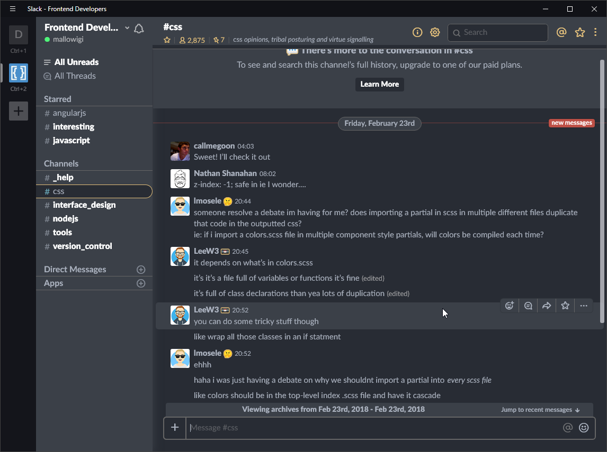

# One Dark Theme for Slack

Atom One Dark Theme for Slack!

# Preview



# Installing into Slack

Find your Slack's application directory.

* Windows: `%homepath%\AppData\Local\slack\`
* Mac: `/Applications/Slack.app/Contents/`
* Linux: `/usr/lib/slack/` (Debian-based)


Open up the most recent version (e.g. `app-2.5.1`) then open
`resources\app.asar.unpacked\src\static\ssb-interop.js`

At the very bottom, add

```js
// First make sure the wrapper app is loaded
document.addEventListener("DOMContentLoaded", function() {

   // Then get its webviews
   let webviews = document.querySelectorAll(".TeamView webview");

   // Fetch our CSS in parallel ahead of time
   const cssPath = 'https://raw.githubusercontent.com/mallowigi/slack-one-dark-theme/master/custom.css';
   let cssPromise = fetch(cssPath).then(response => response.text());

   let customCustomCSS = `
   :root {
      /* Modify these to change your theme colors: */
     --primary: #E5C17C;
     --accent: #568AF2;
     --text: #ABB2BF;
     --background: #282C34;
     --background-elevated: #3B4048;

     /* These should be less important: */
     --background-hover: lighten(#3B4048, 10%);
     --background-light: #AAA;
     --background-bright: #FFF;

     --border-dim: #666;
     --border-bright: var(--primary);

     --text-bright: #FFF;
     --text-dim: #555c69;
     --text-special: var(--primary);
     --text-accent: var(--text-bright);

     --scrollbar-background: #000;
     --scrollbar-border: var(--primary);

     --yellow: #fc0;
     --green: #98C379;
     --cyan: #56B6C2;
     --blue: #61AFEF;
     --purple: #C678DD;
     --red: #E06C75;
     --red2: #BE5046;
     --orange: #D19A66;
     --orange2: #E5707B;
     --gray: #3E4451;
     --silver: #9da5b4;
     --black: #21252b;
      }
   `

   // Insert a style tag into the wrapper view
   cssPromise.then(css => {
      let s = document.createElement('style');
      s.type = 'text/css';
      s.innerHTML = css + customCustomCSS;
      document.head.appendChild(s);
   });

   // Wait for each webview to load
   webviews.forEach(webview => {
      webview.addEventListener('ipc-message', message => {
         if (message.channel == 'didFinishLoading')
            // Finally add the CSS into the webview
            cssPromise.then(css => {
               let script = `
                     let s = document.createElement('style');
                     s.type = 'text/css';
                     s.id = 'slack-custom-css';
                     s.innerHTML = \`${css + customCustomCSS}\`;
                     document.head.appendChild(s);
                     `
               webview.executeJavaScript(script);
            })
      });
   });
});
```

Notice that you can edit any of the theme colors using the custom CSS (for
the already-custom theme.) Also, you can put any CSS URL you want here,
so you don't necessarily need to create an entire fork to change some small styles.

That's it! Restart Slack and see how well it works.

NB: You'll have to do this every time Slack updates.

# Color Schemes

Here's some example color variations you might like.

## Default

```
--primary: #09F;
--text: #CCC;
--background: #080808;
--background-elevated: #222;
```

## One Dark

```
--primary: #61AFEF;
--text: #ABB2BF;
--background: #282C34;
--background-elevated: #3B4048;
```

## Low Contrast

```
--primary: #CCC;
--text: #999;
--background: #222;
--background-elevated: #444;
```

## Navy

```
--primary: #FFF;
--text: #CCC;
--background: #225;
--background-elevated: #114;
```

# Development


## Inspect

Open Slack on the browser. It has the useful Developer Tools available to them so you can debug with ease.

To test your CSS, install a Stylish-like extension (https://chrome.google.com/webstore/detail/stylish-custom-themes-for/fjnbnpbmkenffdnngjfgmeleoegfcffe?hl=en) then create
a new style for slack and paste the CSS inside and save.

## Local Dev

`git clone` the project and `cd` into it.

Change the CSS URL to `const cssPath = 'http://localhost:8080/custom.css';`

Run a static webserver of some sort on port 8080:

```bash
npm install -g static
static .
```

In addition to running the required modifications, you will likely want to add auto-reloading:

```js
const cssPath = 'http://localhost:8080/custom.css';
const localCssPath = '/Users/username/Code/slack-one-dark-theme/custom.css';

window.reloadCss = function() {
   const webviews = document.querySelectorAll(".TeamView webview");
   fetch(cssPath + '?zz=' + Date.now(), {cache: "no-store"}) // qs hack to prevent cache
      .then(response => response.text())
      .then(css => {
         console.log(css.slice(0,50));
         webviews.forEach(webview =>
            webview.executeJavaScript(`
               (function() {
                  let styleElement = document.querySelector('style#slack-custom-css');
                  styleElement.innerHTML = \`${css}\`;
               })();
            `)
         )
      });
};

fs.watchFile(localCssPath, reloadCss);
```

Instead of launching Slack normally, you'll need to enable developer mode to be able to inspect things.

* Mac: `export SLACK_DEVELOPER_MENU=true; open -a /Applications/Slack.app`

* Linux: (todo)

* Windows: (todo)

# Acknowledgements

Thanks to https://github.com/widget-/slack-black-theme for the idea!

# License

Apache 2.0
