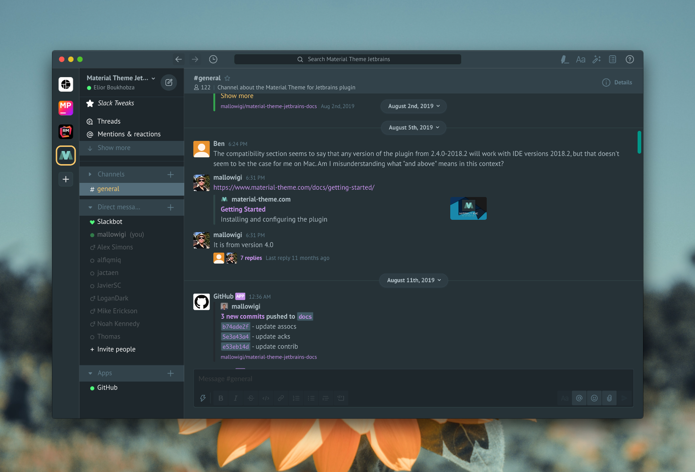
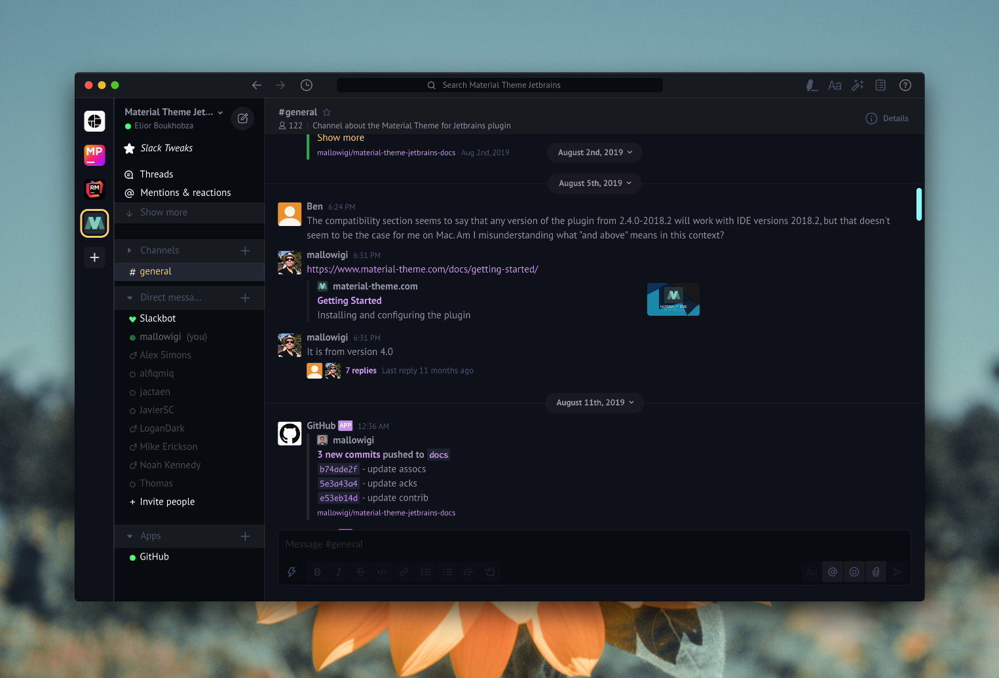
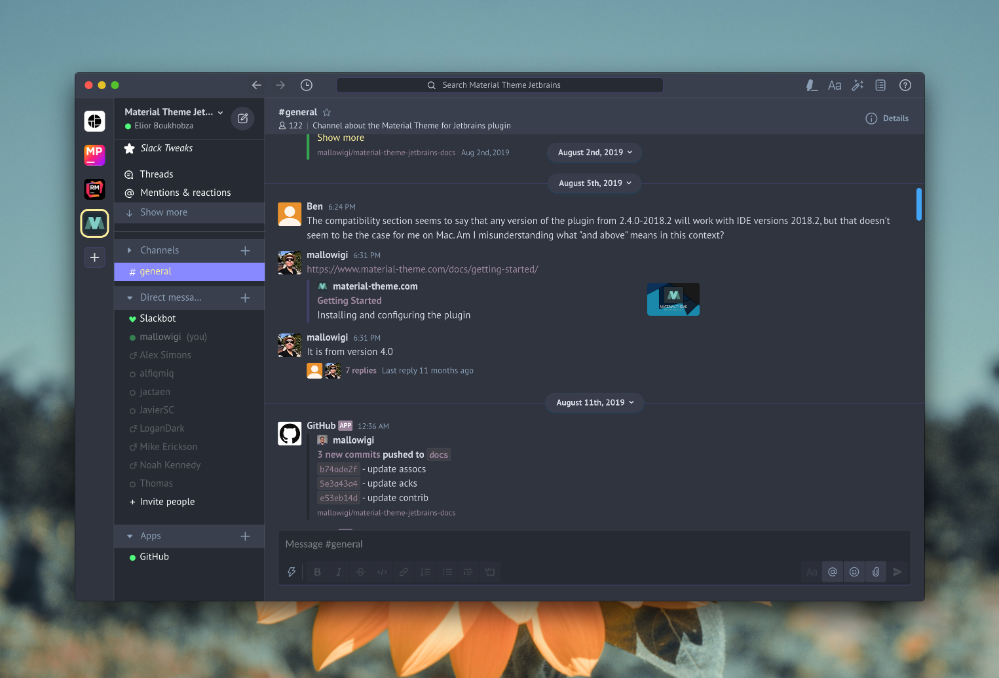
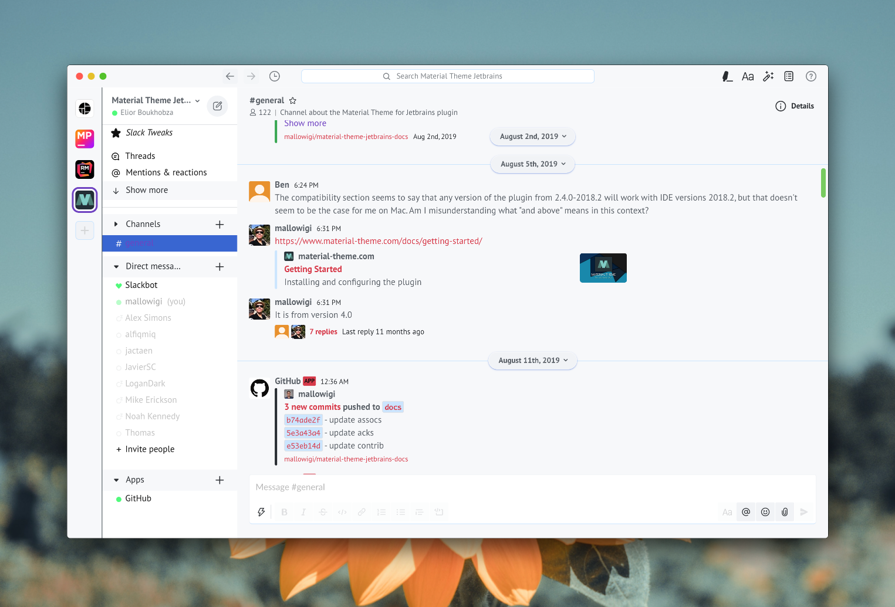
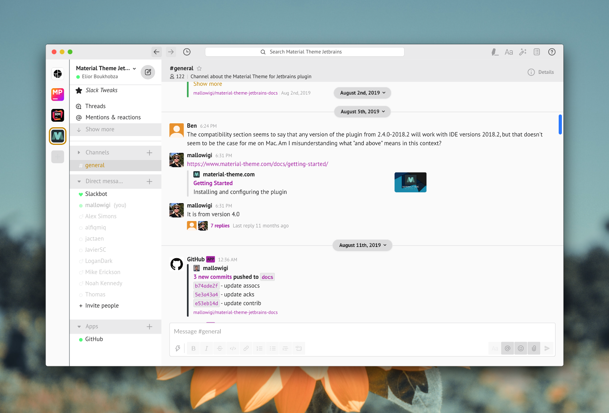
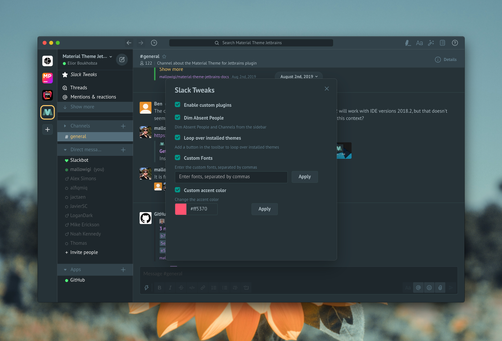

# Slack Theme Collection

Beautify your Slack application from a list of popular themes!!!

Currently works only for Mac OS, Windows and Linux non-SNAP (Marketplace)

**Theme List**:

- Material Oceanic 
- Material Darker 
- Material Palenight 
- Material Lighter 
- Material DeepOcean 
- Monokai Pro 
- Arc Dark 
- Dracula 
- GitHub 
- Atom One Dark 
- Atom One Light 
- Solarized Dark 
- Solarized Light 
- Night Owl 
- Light Owl 
- Moonlight (**NEW!**) 

----------------------------

# Pledge

If you like this plugin, you can buy me a beer (or a coffee, or something else)
using [PayPal](https://paypal.me/mallowigi?locale.x=en_US)

You can also support this theme by subscribing to the Material Theme
OpenCollective. [[Become a sponsor](https://opencollective.com/material-theme-jetbrains#sponsor)]

## Backers

Thank you to all our backers! 🙏 [[Become a backer](https://opencollective.com/material-theme-jetbrains#backer)]

Check also : <http://www.material-theme.com/docs/support-us/>

## Sponsors

Support this project by becoming a sponsor. Your logo will show up here with a link to your
website. [[Become a sponsor](https://opencollective.com/material-theme-jetbrains#sponsor)]

# Installation

### Global installation (works anywhere)

1. Run `npm install -g mtslack` in a terminal
2. Run the command `mtslack`
3. PROFIT!!!

- You will be prompted with a menu with two options:
    - Apply Theme
    - Remove Theme

- Select *Apply Theme* to be prompted with a list of themes to choose with.
- Open or Restart (with Cmd-Q) Slack
- ?????
- PROFIT!!!!!!!

### From npm

- Clone this repository
- Install NodeJS if you didn't do it yet (<https://nodejs.org/en/download/>)
- Run `npm install`
- Run `npm run apply`
- Select **Apply** in the menu, then select a theme from the predefined themes.
- Open or Restart (with Cmd-Q) Slack
- ??????
- PROFIT!!!!!!

### Revert to the default theme

The best way to revert to the default theme would be to use the backup copy you made and overwrite the patched Slack.app

There is also a `Remove Theme` option in the menu but it is less robust.

----

### Slack Tweaks (Beta)

Since version 2.0 you can also profit from a bunch of **Slack Tweaks** to make the application more enjoyable. You can
find a button to open the Slack Tweaks on the channels sidebar.

#### Slack Tweak Control Panel

This panel controls which tweak toggles are available. **This doesn't actually toggle the tweaks themselves!**.

Once you've enabled a tweak, a new toggle button will appear on the Channel Header. Pressing on these buttons will
activate the tweak.

These settings are saved in the application's Local Storage.

#### Dim Absent People

This button will dim absent people from the sidebar, making the present ones more prominent.

#### Loop Over selected themes

This button will loop over the available themes, allowing you to choose a theme in realtime.

#### Toggle Custom Font

Switch the fonts used in the app with the font you've defined in the Slack Tweak Settings.

#### Toggle Custom Monospace Font

Switch the monospace font size and family used in the app with the font you've defined in the Slack Tweak Settings.

#### Toggle Accent Color

Switch the current theme's accent color with the one of your choice. You can set the desired color in the Slack Tweak
Settings.

### Important Note!

Please note that these tweaks rely on modifying the app realtime. There's a high chance further updates from Slack would
break those tweaks. In this case please report to the repository, thanks!

----

# Development

## Building styles

This project consists in two parts:

- The CLI, used for applying the styles
- The Styles, written with Sass (Node-sass)

The cli is found in the `lib` directory while the styles are found in the `styles` directory.

Then run `npm run styles` or `npm run debugStyles` to compile the scss files in `dist/slack.min.css` or `dist/slack.css`

## Apply the styles

### Using the WebApp

Open Slack on the browser. It has the useful Developer Tools available to them so you can debug with ease.

To test your CSS, install a Stylish-like
extension (<https://chrome.google.com/webstore/detail/stylish-custom-themes-for/fjnbnpbmkenffdnngjfgmeleoegfcffe?hl=en>)
then create a new style for slack and paste the CSS inside and save.

You should already see all your styles applied. Please note that there are some differences between the web app and the
native app.

### Using the Electron app

1. Run `npm run server` to run a local server
2. Run `watchStyles` or `watchScripts` to watch for changes in styles or code
3. Run `npm run local` to run `apply` with the styles pointing to localhost
4. Run `npm run debug`

**IMPORTANT**: Please make sure to have enabled "Disable cache when devtools is open" in Chrome Settings.

Also don't forget to re-apply the production styles before quitting :)

----
Instead of launching Slack normally, you'll need to enable developer mode to be able to inspect things.

* Mac: `export SLACK_DEVELOPER_MENU=true; open -a /Applications/Slack.app`

* Linux: (todo)

* Windows: `export SLACK_DEVELOPER_MENU=true;  ~/AppData/Local/slack.exe`

# License

Apache 2.0

# Acknowledgements

Thanks to <https://github.com/widget-/slack-black-theme> for the idea!

# License

Apache 2.0
